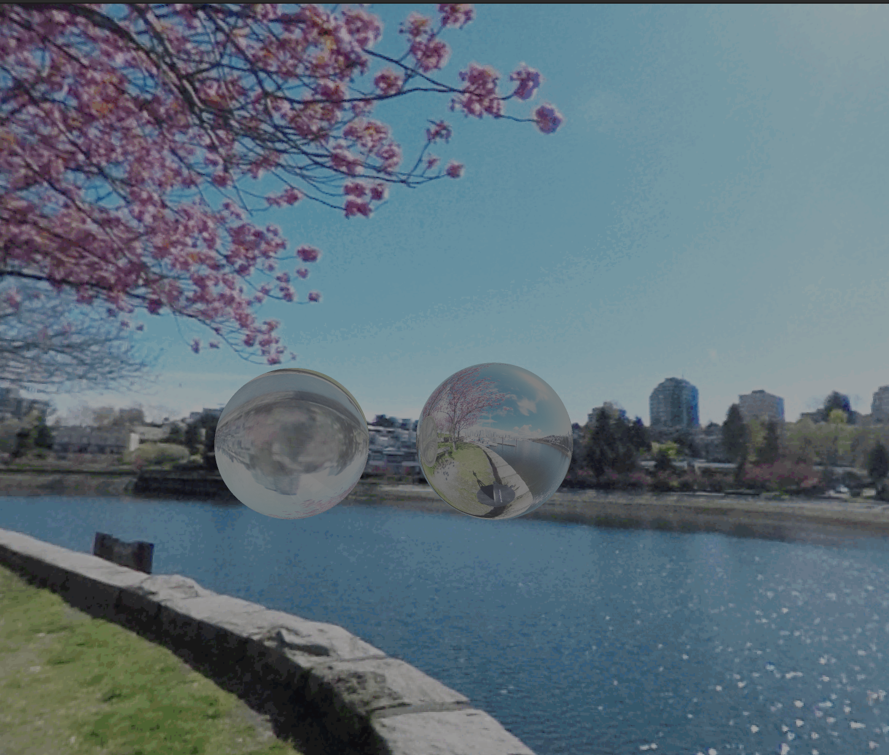

# miniRT

MiniRT is a ray tracing project written in C as part of the 42 curriculum. The program reads a file describing a scene, containing information about the placement of geometric objects in space and their properties, as well as the position and orientation of the camera. Ambient light is defined, along with potential other light sources.

## Features

- Representation of spheres, planes, cylinders, cones, and triangles.
- Multiple light sources (colored or not) and calculation of different types of object illumination: ambient, diffuse, and specular.
- Handling of reflective materials, transparency, and partial refraction.
- Management of luminescent (glowing) objects, independently illuminated from light sources.
- Handling of objects that diffuse light (rudimentary).
- Application of color perturbations or bitmap images to objects.
- Real-time control of camera position and orientation with keyboard and mouse.
- Multi-threaded rendering.
- Resizable window.
- Chunk system for adjusting the number of rays per pixel, enabling sampling for faster rendering or anti-aliasing.
- Regular movements applied to objects (only rotations are currently managed).

## Usage

1. Clone the repository:
    ```bash
    git clone <repo_address> <destination_dir>
    ```

2. Compile the program:
    ```bash
    make
    ```

3. Run MiniRT with a scene file:
    ```bash
    ./minirt [scene_file].rt
    ```

## Shortcuts

- Left mouse click: Look around.
- Mouse scroll: Move forward or backward in the direction you're looking.
- Arrow keys: Move in space.
- `[` and `]`: Decrease or increase the number of threads.
- `-` and `+`: Decrease or increase the size of chunks.

## Scene File Parsing Rules:

Lowercase types can be defined multiple times in the scene. For each object, the values of each property (except the object type) must be preceded by the property name. Example: `sp origin:2,2,2 iref:1.1`

- C [origin] [orientation] [fov]
- A [ratio] [color]
- l [origin] [ratio] [color]
- sp [origin] [diameter] [texture] [ka] [kd] [ks] [kr] [iref] [p] [r] [...]
- pl [origin] [orientation] [texture] [ka] [kd] [ks] [kr] [iref] [p] [r] [...]
- cy [origin] [orientation] [diameter] [height] [texture] [ka] [kd] [ks] [kr] [iref] [p] [r] [...]
- co [origin=center of base] [orientation] [radius] [height] [texture] [ka] [kd] [ks] [kr] [iref] [p] [r] [...]
- tr [tr1] [tr2] [tr3] [...]
- move [target:target] [type:RTS] [value:orientation] [speed:speed]

### Texture:

- Solid color: [S:color]
- Checkerboard: [D:color1:color2:resolution], resolution = number of vertical cells/unit
- Image: [I:path], must be within "" if it contains spaces.

### Object Properties:

- ka: ambient light reflection constant (0 <= ka <= 1)
- kd: diffuse light reflection constant (0 <= kd <= 1)
- ks: specular light reflection constant (0 <= ks <= 1)
- kr: reflection constant (0 <= kr <= 1)
- iref: refraction factor (0 <= INFINITY)
- sp: portion of plastic reflection on surface (0 <= p <= 1)
- sr: roughness of material constant (1 <= r <= INFINITY)
- glow-color: color of glowing object
- glow-ratio: glowing illumination factor (0 for non-glowing objects)
- light-color: color of light diffused by the object
- light-ratio: diffusion of light by the object (0 for non-diffusing object)
- trN: position of vertex number N for triangles

The parsing rules define how the different properties of objects are defined in the scene file. This allows MiniRT to correctly interpret the information to generate the ray tracing scene.

## Reflection and Refraction:

The calculation of the contribution of reflected and refracted rays to the illumination of a pixel approximately follows the Fresnel's law. The respective contribution of each of the two rays is defined by the value of kr. For optimization reasons, a reflected ray is only cast if kr > 0 and a refracted ray is only cast if kr < 0.99. Thus, if a material has a reflection index of 1.0, only reflected rays will be cast, and conversely for an index of 0.0001. A material with an index of 0 will neither be reflective nor transparent.

Examples:
- For a material with an index of 0.5, to the calculation of the primary ray's brightness will be added 50% of the color of the reflected ray and 50% of the refracted ray's color.
- For an index of 0.01, 99% of the refracted ray and 1% of the reflected ray.
- For an index of 0.991, 0% of the refracted ray and 100% of the reflected ray.

The maximum number of child rays (bounces) is defined by the macro MAX_BOUNCE.

The iref property of objects allows defining their refractive index following Fresnel's law. It defines the refractive index of the medium composing the interior of the objects. Thus, refraction is ignored for planes (since there is no interior medium to a plane).




## Camera Movement:

Camera movements in the y-direction (relative to the screen) are applied to the camera, while movements in the x-direction are applied to the scene. This avoids rotation around the 3rd axis (rolling) inherent in rotations around the other two axes.

For certain initial camera orientations, rolling may be introduced, which can give the sensation that objects are not oriented correctly. In fact, the camera rotates relative to the user's screen, but in relation to the scene, the orientation is correct.

## Luminescent and Diffusing Material

The glow-ratio and glow-color properties define objects that emit light regardless of any external light source. The light-ratio and light-color properties define objects that emit their own light and behave like light sources (similar to a sun). However, these objects are not illuminated by their own light (the rays they produce ignore intersections with their surfaces). This is a somewhat unrealistic approximation since the source of their light corresponds to their center and not to every point on their surface. Thus, this property works relatively well with spheres or cylinders but not so well with cones, planes, or triangles.


## Textures

### Color Perturbation:
The color perturbation texture is defined as [D:color1:color2:resolution], where resolution indicates the number of vertical cells per unit. A higher resolution will increase the number of squares for a given surface. Using an odd resolution can yield interesting results.


### Image Texture:
Image texture is specified as [I:path], and the path must be within "" if it contains spaces.


### Object Movements and Transformations:

This section outlines the properties and rules governing object movements and transformations within the scene.

#### Movement Properties:

- **Target**:
  - > 0: Identifies the ID of the target object.
  - 0: Applies to every object in the scene.

- **Type**:
  - **R**: Indicates rotation.
  - **Rs**: Denotes self-rotation specifically for spheres.
  - **T**: Represents translation.
  - **S**: Signifies scaling.

- **Orientation**:
  - For rotation: angle_x, angle_y, angle_z.
  - For translation: value_x, value_y, value_z.
  - For scale: value_x, value_y, value_z.

- **Speed**:
  - Specifies the number of moves per second.
    - For example, for 30 FPS and speed=1, all values are to be multiplied by 1/30 at each rendering.
    - For render_time = 1.5s, the value is calculated as 1.5/1 * speed.

#### Notes:
- At present, only rotations are fully managed, including self-rotations for spheres.
- Rotations may not behave correctly when the camera orientation changes.


### Sampling, Multithreading, and Antialiasing

- For each chunk, a ray is launched. The size of the chunks determines the number of pixels corresponding to the brightness calculated for a launched ray. Thus, increasing the size of the chunks decreases the total number of rays (divided by 4 each time) and the rendering time of each frame. This enables sampling and pixelization of the scene, allowing, for example, the identification of an optimal camera position in a computationally intensive scene.

- Conversely, decreasing the size of the chunks increases the number of rays launched. A size of 1 means launching 1 pixel per ray. When the size of the chunks becomes negative, multiple rays per pixel are launched, and the final pixel color is the average of the colors of all launched rays.

- The total number of chunks is always an even number. The chunks are distributed among different threads so that each thread has the same number of chunks to compute. Hence, the number of threads must be a multiple of the total number of chunks. It is automatically adjusted when modifying the chunk size or the window size.

- The number of threads can also be adjusted in real-time to find the optimal balance for the machine. However, certain window dimensions may abruptly increase the number of threads used (based on the nearest multiple of the number of chunks found).


### Triangle

The inclusion of triangles enables the potential modeling of any complex geometric shape, provided it can be decomposed into a finite number of triangles. The tool developed by matboivin ([minirt_mesh_converter](https://github.com/matboivin/minirt_mesh_converter)) facilitates the conversion of triangles composing objects described in a .obj file into an .rt format.

The syntax used in the .rt files generated by the tool is slightly different from ours, requiring minor modifications to the output file. The following regex can be applied:

- **Pattern**: `(-?\d+(\.\d+)?,-?\d+(\.\d+)?,-?\d+(\.\d+)?) (-?\d+(\.\d+)?,-?\d+(\.\d+)?,-?\d+(\.\d+)?) (-?\d+(\.\d+)?,-?\d+(\.\d+)?,-?\d+(\.\d+)?) (\d+,\d+,\d+)`
- **Substitution**: `tr1:$1 tr2:$5 tr3:$9 texture:S:$13`


---

With MiniRT, you can explore the fascinating world of ray tracing and create stunning visual scenes. Explore the possibilities and unleash your creativity!
